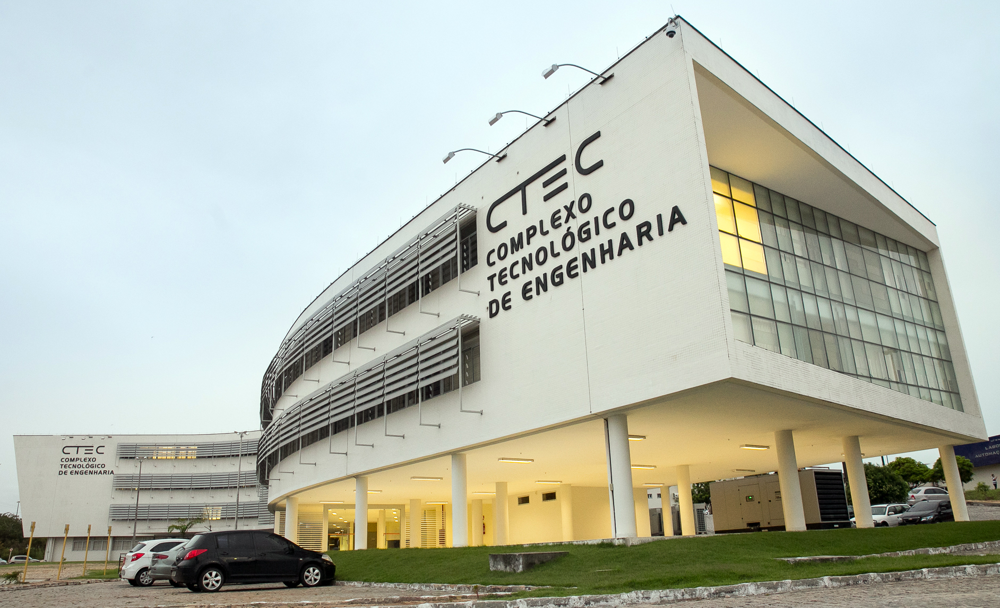

# Federal University of Rio Grande do Norte
## Technology Center
### Department of Computer Engineering and Automation 
#### Machine Learning Based Systems Design

#### References

- :books: Chip Huyen. Designing Machine Learning Systems: An Iterative Process for Production-Ready Applications. [[Link]](https://www.amazon.com/Designing-Machine-Learning-Systems-Production-Ready/dp/1098107969)
- :books: Noah Gift, Alfredo Deza. Practical MLOps: Operationalizing Machine Learning Models [[Link]](https://www.amazon.com/Practical-MLOps-Operationalizing-Machine-Learning/dp/1098103017/)
- :books: Hannes Hapke, Catherine Nelson. Building Machine Learning Pipelines. [[Link]](https://www.oreilly.com/library/view/building-machine-learning/9781492053187/)
- :books: Mariano Anaya. Clean Code in Python [[Link]](https://www.packtpub.com/product/clean-code-in-python-second-edition/9781800560215)
- :books: Aurélien Géron. Hands on Machine Learning with Scikit-Learn, Keras and TensorFlow. [[Link]](https://www.oreilly.com/library/view/hands-on-machine-learning/9781492032632/)
- :fist_right: Dataquest Academic Program [[Link]](https://www.dataquest.io/academic-program/)
- :smiley: CS329S - ML Systems Design [[Link]](https://stanford-cs329s.github.io/syllabus.html)

#### Lessons

**Week 01**: Course Outline
- [Git and Version Control](https://www.dataquest.io/course/git-and-vcs/)
    - You'll learn how to: a) organize your code using version control, b) resolve conflicts in version control, c) employ Git and Github to collaborate with others.
    
**Week 02**: CLI fundamentals
- Elements of the Command Line
	- Introduction to the Command Line [[Link]](https://app.dataquest.io/c/67/m/383/introduction-to-the-command-line)
	- The Filesystem [[Link]](https://app.dataquest.io/c/67/m/384/the-filesystem)
	- Modifying the Filesystem [[Link]](https://app.dataquest.io/c/67/m/385/modifying-the-filesystem)
	- Glob Patterns and Wildcards [[Link]](https://app.dataquest.io/c/67/m/386/glob-patterns-and-wildcards)
	- Users and Permissions [[Link]](https://app.dataquest.io/c/67/m/387/users-and-permissions)
- Text Processing in the Command Line
	- Getting Help and Reading Documentation [[Link]](https://app.dataquest.io/c/68/m/388/getting-help-and-reading-documentation)
	- File Inspection [[Link]](https://app.dataquest.io/c/68/m/389/file-inspection)
	- Text Processing [[Link]](https://app.dataquest.io/c/68/m/390/text-processing)
	- Redirection and Pipelines [[Link]](https://app.dataquest.io/c/68/m/391/redirection-and-pipelines)
	- Standard Streams and File Descriptors [[Link]](https://app.dataquest.io/c/68/m/392/standard-streams-and-file-descriptors)
