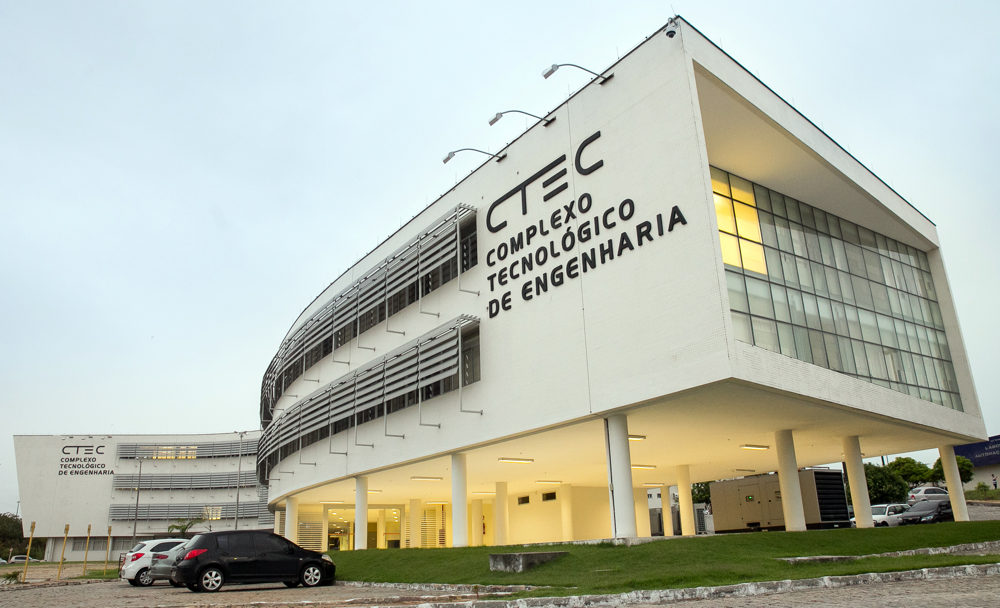

# Federal University of Rio Grande do Norte
## Technology Center
### Department of Computer Engineering and Automation 

Repository for the **Machine Learning-Based Systems Design** course, offered as an elective in the Computer Engineering undergraduate program at UFRN.  

                                                
## 📚 References  

| Title & Authors | Date | Link |
|-----------------|------|------|
| **Muhammad Asad and Iqbal Khan** *NLP with Hugging Face Transformers: Practical Applications using Language Models* | May, 2025 | [:books: Link](https://machinelearningmastery.com/nlp-hugging-face-transformers/) |
| **Chip Huyen** *AI Engineering: Building Applications with Foundation Models* | Jan, 2025 | [:books: Link](https://www.oreilly.com/library/view/ai-engineering/9781098166298/) |
| **Paul Lusztin and Maxime Labonne** *LLM Engineer's Handbook* | Oct, 2024 | [:books: Link](https://www.oreilly.com/library/view/llm-engineers-handbook/9781836200079/) |
| **Jay Alammar and Maarten Grootendorst** *Hands-On Large Language Models: Language Understanding and Generation* | Sep, 2024 | [:books: Link](https://www.oreilly.com/library/view/hands-on-large-language/9781098150952/) |
| **Chip Huyen** *Designing Machine Learning Systems: An Iterative Process for Production-Ready Applications* | May, 2022 | [:books: Link](https://www.oreilly.com/library/view/designing-machine-learning/9781098107956/) |
| **Daniel Voigt Godoy** *Deep Learning with PyTorch Step-by-Step: A Beginner’s Guide* | Feb, 2022 | [:books: Link](https://pytorchstepbystep.com/) |

---

#### Lessons

**Week 01**
-  Course Outline 
    - GitHub Education Pro: Get access to the GitHub Education Pro pack by visiting [GitHub Education](https://education.github.com/pack)
    - 📖 Learning Resources 
        - GitHub Learning Game: Check out the interactive Git learning game at [GitHub Learning Game](https://learngitbranching.js.org/)
	- Michael A. Lones. How to avoid machine learning pitfalls: a guide for academic researchers [Arxiv](https://arxiv.org/abs/2108.02497)

**Week 02**
-  Visualizing Gradient Descent
    - Understanding and visualizing the five core steps of the Gradient Descent algorithm: 
        1. initializing parameters randomly
        2. performing the forward pass to compute predictions
        3. calculating the loss
        4. computing gradients with respect to each parameter
        5. updating the parameters using the gradients and a predefined learning rate. 
-  Rethinking the Training Loop (Part I)
    -   From data deneration to make predictions
        - Implement a clear `train()` function with custom dataset and `DataLoader`.  
        - Apply mini-batch gradient descent and track performance.  
        - Add persistence: save checkpoints and enable training resumption/deployment.
    -  Going Classy
        - Build a dedicated training class with a well-structured constructor.  
        - Use proper method scoping (public/protected/private).  
        - Consolidate earlier code into the class.  
        - Run the full pipeline through the class interface.      

**Week 03**
-   Rethinking the Training Loop (Part II) - A Real-World Case Study
    - Predicting Airbnb nightly prices in **Porto, Portugal** with PyTorch, using the [Inside Airbnb](https://insideairbnb.com/porto/) snapshot of June 23, 2026 (15,278 real listings).
    - From business problem to model: framing a pricing question as a regression task and setting an honest naive baseline (predict the mean) that the model must beat.
    - Exploratory data analysis with data visualization best practices: one question per chart, sequential/diverging color scales, direct labeling, and a geographic scatter map of the listings.
    - Real-world data preparation: parsing currency strings, handling missing values, and robust IQR-based outlier filtering (Tukey's rule).
    - Reusing the `Architecture` class from lesson 3b **unchanged** to train a multivariate linear regression on real data: tensors, `random_split`, z-score standardization without data leakage, and `DataLoader`s.
    - Honest evaluation in euros: RMSE/MAE vs. the baseline, predicted-vs-actual analysis, and interpreting learned weights (multicollinearity and the "beds paradox").
    - Saving/loading checkpoints with the scaler statistics and serving a prediction for a brand-new listing.
    - Retention devices throughout: 🔮 predict-before-you-run prompts, ✅ check-yourself questions, a final self-test with hidden answers, and 7 hands-on challenges.

**Week 04**
-  A Brief History of LLMs (2014 → 2026)
    - The problem before 2017: statistical translation, word2vec, seq2seq, and attention as a patch.
    - The Transformer and the family split: encoders that read (BERT) vs. decoders that write (GPT).
    - Scaling and GPT-3: the task lives in the prompt (in-context learning).
    - RLHF and ChatGPT: from text completer to assistant.
    - The 2023 race and its limits: hallucination, knowledge cut-off, and RAG.
    - 2024–25: multimodality, long context, reasoning models, DeepSeek and Mixture of Experts.
    - Agents: tool calling, MCP, memory, and skills.
    - 2026 headlines, told through primary sources (papers, launch posts, rebuilt charts).
    
-   Before the Transformer: squeeze, then attend
    - The 2014–2015 chapter of the lecture, hands-on: English → Portuguese translation on real data ([Tatoeba](https://tatoeba.org) pairs), scored with BLEU, the same metric the Transformer paper reports.
    - Training a 2014-style **seq2seq** (two LSTMs, one fixed context vector) by reusing the `Architecture` class from lesson 3b with only two methods overridden (teacher forcing).
    - **Measuring the bottleneck**: BLEU as a function of sentence length, and watching quality fall as the single vector fills up.
    - Adding **Bahdanau attention** and re-running the same measurement: the fall flattens, and the attention weights become a readable **alignment map** ("red" → "vermelho"), the same figure as the 2015 paper.
    - Ends right where Wednesday begins: attention fixed the bottleneck, not the slowness — the question the Transformer answers.
    - Exercises: swap the language pair (URLs for French, Spanish, German, and Italian included), compare length curves across languages, stress the bottleneck with longer sentences, and read a foreign alignment.
